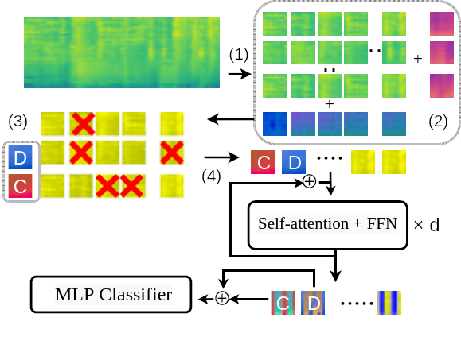

# PaSST: Efficient Training of Audio Transformers with Patchout


This is the implementation for [Efficient Training of Audio Transformers with Patchout](https://arxiv.org/abs/2110.05069)

Patchout significantly reduces the training time and GPU memory requirements to train transformers on audio spectrograms, while improving their performance.

<p align="center"></p>

Patchout works by dropping out some of the input patches during training. In either a unstructured way (randomly, similar to dropout), or entire time-frames or frequency bins of the extracted patches (similar to SpecAugment), which corresponds to rows/columns in step 3 of the figure below.  



# Inference or Embeddings pre-trained models 
If you only want to use the embeddings generated by the pretrained models, use your own fine-tuning framework, or you need it only for inference, you can find a stripped down version of this repo [here](https://github.com/kkoutini/passt_hear21). 
The package follows [HEAR 2021 NeurIPS Challenge](https://neuralaudio.ai/hear2021-results.html) API, and can be installed:
 
```shell
pip install -e 'git+https://github.com/kkoutini/passt_hear21@0.0.17#egg=hear21passt' 
```
This repo is a complete framework for training the models and fine-tuning pre-trained models on Audioset on downstream tasks.
## Getting the logits from the pretrained models 
```python
from hear21passt.base import get_basic_model,get_model_passt
import torch
# get the PaSST model wrapper, includes Melspectrogram and the default pre-trained transformer
model = get_basic_model(mode="logits")
print(model.mel) # Extracts mel spectrogram from raw waveforms.
print(model.net) # the transformer network.

# example inference
model.eval()
model = model.cuda()
with torch.no_grad():
    # audio_wave has the shape of [batch, seconds*32000] sampling rate is 32k
    # example audio_wave of batch=3 and 10 seconds
    audio = torch.ones((3, 32000 * 10))*0.5
    audio_wave = audio.cuda()
    logits=model(audio_wave) 
```
## Getting a pre-trained model for fine tuning
```python
from hear21passt.base import get_basic_model,get_model_passt
import torch
# get the PaSST model wrapper, includes Melspectrogram and the default pre-trained transformer
model = get_basic_model(mode="logits")
print(model.mel) # Extracts mel spectrogram from raw waveforms.

# optional replace the transformer with one that has the required number of classes i.e. 50
model.net = get_model_passt(arch="passt_s_swa_p16_128_ap476",  n_classes=50)
print(model.net) # the transformer network.


# now model contains mel + the transformer pre-trained model ready to be fine tuned.
# It's still expecting input of the shape [batch, seconds*32000] sampling rate is 32k

model.train()
model = model.cuda()

```

# Setting up the experiments environment
This repo uses forked versions of sacred for configuration and logging, and pytorch-lightning for training.

For setting up [Mamba](https://github.com/mamba-org/mamba) is recommended and faster then `conda`:

```shell
conda install mamba -n base -c conda-forge
```
Now you can import the environment from `environment.yml`
```shell
mamba env create -f environment.yml
```
Now you have an environment named `ba3l`. Now install the forked versions of `sacred` and `pl-lightning` and `ba3l`.
```shell
# dependencies
conda activate ba3l
pip install -e 'git+https://github.com/kkoutini/ba3l@v0.0.2#egg=ba3l'
pip install -e 'git+https://github.com/kkoutini/pytorch-lightning@v0.0.1#egg=pytorch-lightning'
pip install -e 'git+https://github.com/kkoutini/sacred@v0.0.1#egg=sacred' 
```

In order to check the environment we used in our runs, please check the `environment.yml` and `pip_list.txt` files.
 Which were exported using:
```shell
conda env export --no-builds | grep -v "prefix" > environment.yml
pip list > pip_list.txt
```

# Getting started 
Each dataset has an experiment file such as `ex_audioset.py` and `ex_openmic.py` and a dataset folder with a readme file.
In general, you can prob the experiment file for help:
```shell
python ex_audioset.py help
```

you can override any of the configuration using the [sacred syntax](https://sacred.readthedocs.io/en/stable/command_line.html).
In order to see the available options either use [omniboard](https://github.com/vivekratnavel/omniboard) or use:
```shell
 python ex_audioset.py print_config
 ```
There are many pre-defined configuration options in `config_updates.py`. These include different models, setups etc...
You can list these configurations with: 
```shell
python ex_audioset.py print_named_configs
```
The overall configurations looks like this:
```yaml
  ...
  seed = 542198583                  # the random seed for this experiment
  slurm_job_id = ''
  speed_test_batch_size = 100
  swa = True
  swa_epoch_start = 50
  swa_freq = 5
  use_mixup = True
  warm_up_len = 5
  weight_decay = 0.0001
  basedataset:
    base_dir = 'audioset_hdf5s/'     # base directory of the dataset, change it or make a link
    eval_hdf5 = 'audioset_hdf5s/mp3/eval_segments_mp3.hdf'
    wavmix = 1
    ....
    roll_conf:
      axis = 1
      shift = None
      shift_range = 50
  datasets:
    test:
      batch_size = 20
      dataset = {CMD!}'/basedataset.get_test_set'
      num_workers = 16
      validate = True
    training:
      batch_size = 12
      dataset = {CMD!}'/basedataset.get_full_training_set'
      num_workers = 16
      sampler = {CMD!}'/basedataset.get_ft_weighted_sampler'
      shuffle = None
      train = True
  models:
    mel:
      freqm = 48
      timem = 192
      hopsize = 320
      htk = False
      n_fft = 1024
      n_mels = 128
      norm = 1
      sr = 32000
      ...
    net:
      arch = 'passt_s_swa_p16_128_ap476'
      fstride = 10
      in_channels = 1
      input_fdim = 128
      input_tdim = 998
      n_classes = 527
      s_patchout_f = 4
      s_patchout_t = 40
      tstride = 10
      u_patchout = 0
      ...
  trainer:
    accelerator = None
    accumulate_grad_batches = 1
    amp_backend = 'native'
    amp_level = 'O2'
    auto_lr_find = False
    auto_scale_batch_size = False
    ...
```
There are many things that can be updated from the command line.
In short:
 - All the configuration options under `trainer` are pytorch lightning trainer [api](https://pytorch-lightning.readthedocs.io/en/1.4.1/common/trainer.html#trainer-class-api). For example, to turn off cuda benchmarking add `trainer.benchmark=False` to the command line. 
 - `models.net` are the PaSST (or the chosen NN) options.
 - `models.mel` are the preprocessing options (mel spectrograms).

# Training on Audioset
Download and prepare the dataset as explained in the [audioset page](audioset/)
The base PaSST model can be trained for example like this:
```bash
python ex_audioset.py with trainer.precision=16  models.net.arch=passt_deit_bd_p16_384 -p -m mongodb_server:27000:audioset21_balanced -c "PaSST base"
```

For example using only unstructured patchout of 400:
```bash
python ex_audioset.py with trainer.precision=16  models.net.arch=passt_deit_bd_p16_384  models.net.u_patchout=400  models.net.s_patchout_f=0 models.net.s_patchout_t=0 -p -m mongodb_server:27000:audioset21_balanced -c "Unstructured PaSST base"
```

Multi-gpu training can be enabled by setting the environment variable `DDP`, for example with 2 gpus:

```shell
 DDP=2 python ex_audioset.py with trainer.precision=16  models.net.arch=passt_deit_bd_p16_384 -p -m mongodb_server:27000:audioset21_balanced -c "PaSST base 2 GPU"
```


# Pre-trained models
Please check the [releases page](https://github.com/kkoutini/PaSST/releases/), to download pre-trained models. 
In general, you can get a pretrained model on Audioset using 
```python
from models.passt import get_model
model  = get_model(arch="passt_s_swa_p16_128_ap476", pretrained=True, n_classes=527, in_channels=1,
                   fstride=10, tstride=10,input_fdim=128, input_tdim=998,
                   u_patchout=0, s_patchout_t=40, s_patchout_f=4)
```
this will get automatically download pretrained PaSST on audioset with with mAP of ```0.476```. the model was trained with ```s_patchout_t=40, s_patchout_f=4``` but you can change these to better fit your task/ computational needs.

There are several pretrained models availble with different strides (overlap) and with/without using SWA: `passt_s_p16_s16_128_ap468, passt_s_swa_p16_s16_128_ap473, passt_s_swa_p16_s14_128_ap471, passt_s_p16_s14_128_ap469, passt_s_swa_p16_s12_128_ap473, passt_s_p16_s12_128_ap470`. 
For example, In `passt_s_swa_p16_s16_128_ap473`: `p16` mean patch size is `16x16`, `s16` means no overlap (stride=16), 128 mel bands, `ap473` refers to the performance of this model on Audioset mAP=0.479.

In general, you can get a this pretrained model using:
```python
from models.passt import get_model
passt = get_model(arch="passt_s_swa_p16_s16_128_ap473", fstride=16, tstride=16)
```
Using the framework, you can evaluate this model using:
```shell
python ex_audioset.py evaluate_only with passt_s_swa_p16_s16_128_ap473
```

Ensemble of these models are provided as well:
A large ensemble giving `mAP=.4956`
```shell
python ex_audioset.py evaluate_only with  trainer.precision=16 ensemble_many
```
An ensemble of 2 models with `stride=14` and `stride=16` giving `mAP=.4858`
```shell
python ex_audioset.py evaluate_only with  trainer.precision=16 ensemble_s16_14
```
As well as other ensembles `ensemble_4`, `ensemble_5`
# Contact
The repo will be updated, in the mean time if you have any questions or problems feel free to open an issue on GitHub, or contact the authors directly.
